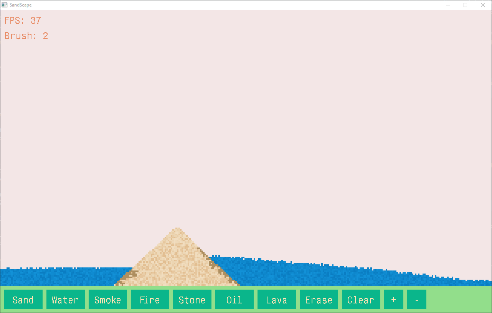
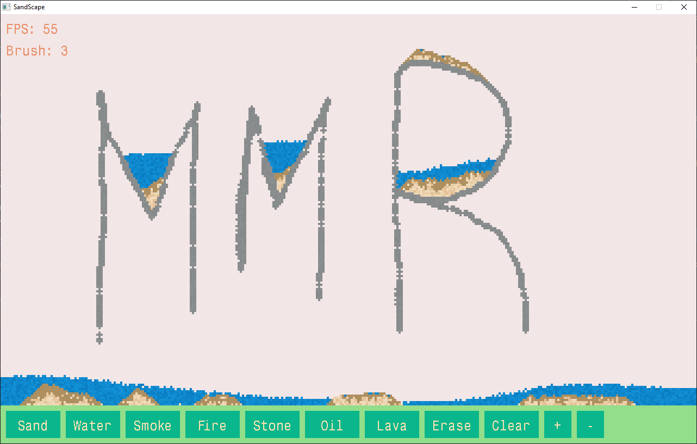
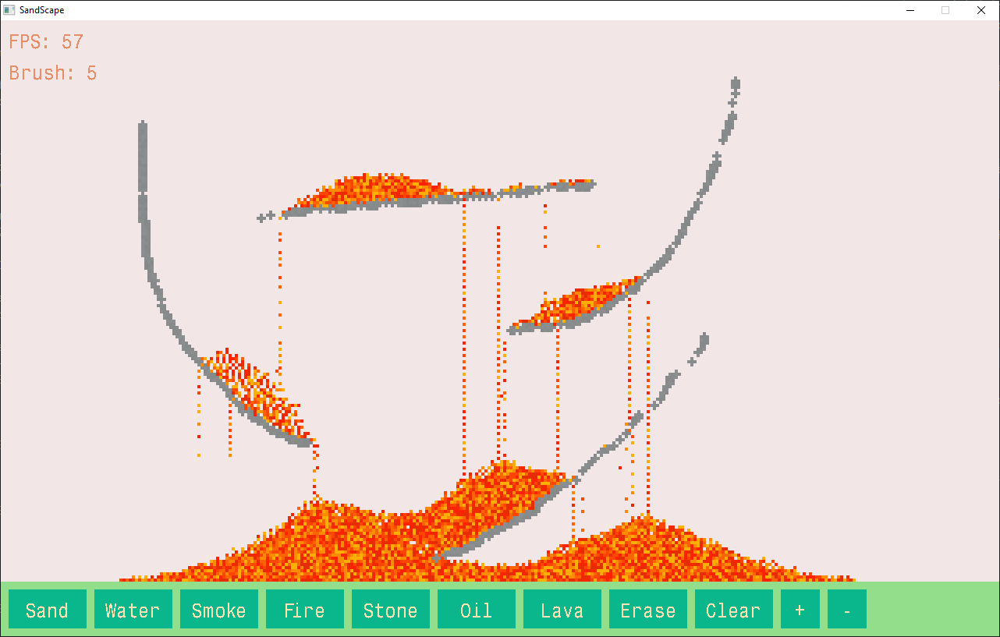
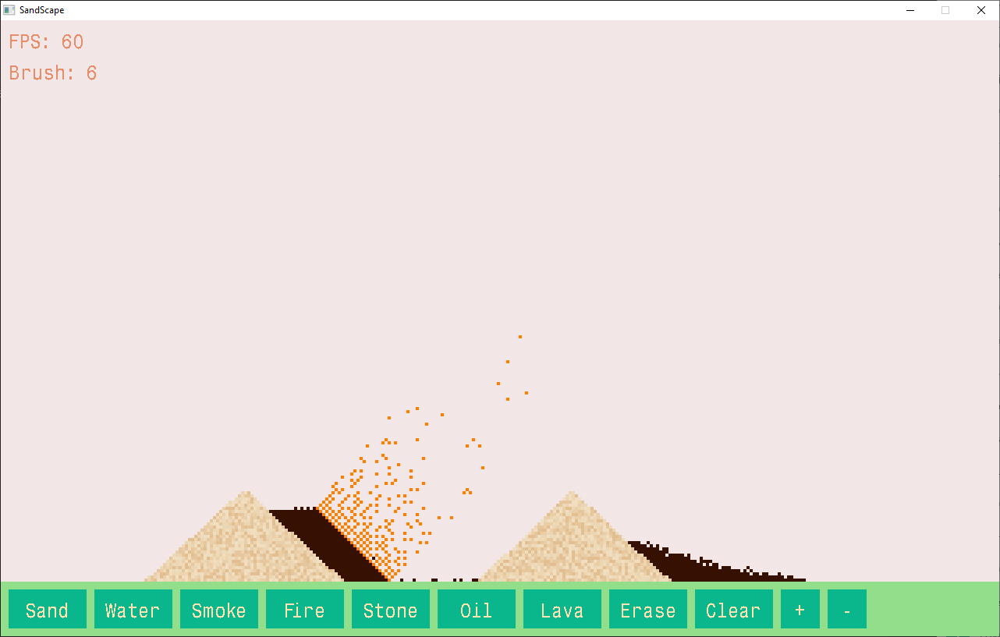
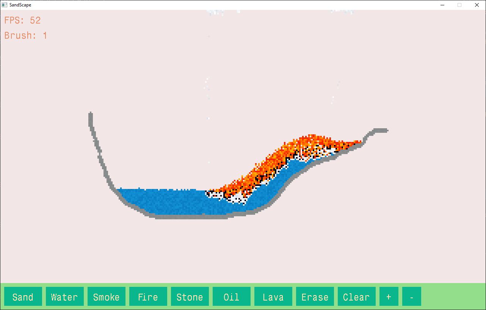

# SandScape
## Description
A simple falling sand simulation game where players can interact with different types of particles that react and behave according to realistic physics rules. This project was developed as part of the CSE 4202 Structured Programming II course group assignment at the Islamic University of Technology. The game is built in plain C using SDL2.

## Features
* Interactive particle system with realistic physics simulation
* Multiple particle types (Such as, Sand, Water, Fire etc) with different behaviors and interactions
* Real-time particle manipulation using mouse input

## Team Members
* Md. Rezwan Azam (220041255)
* Mahdeen Mannaf (220041252)
* Mazharul Islam (220041251)

## Installation
At the time of making the project the entire code was in just one main file. Now it has been moved to [old_main.c](src/old_main.c). The old code used SDL2 and the [Nuklear](https://github.com/Immediate-Mode-UI/Nuklear) GUI library for the UI creation of the game. Later, the old code was refactored and moved to separate files and now uses just SDL2 for UI creation. To play the game, you can download the pre-built exe files (old or the refactored) along with the SDL2 DLLs. Or you can build the game by running the Makefile using 32-bit make. Follow the instructions:  
1. Clone the repository:
    ```bash
    git clone https://github.com/rezwann-jpg/SandScape.git
    ```

2. Navigate to the project directory:
    ```bash
    cd SandScape
    ```

3. Build the sources:
    ```bash
    mingw32-make
    ```

4. Run the game:
    ```bash
    mingw32-make run
    ```

## How to Play
Click the buttons at the bottom of the game window to select particles and left-click and drag to place particles.

## Course Information
* Course: CSE 4202 Structured Programming II 
* Institution: Islamic University of Technology
* Term: 2nd Semester

## Screenshots






## Future Improvements
* Additional particle types and interactions
* Enhanced visual effects
* Performance optimizations